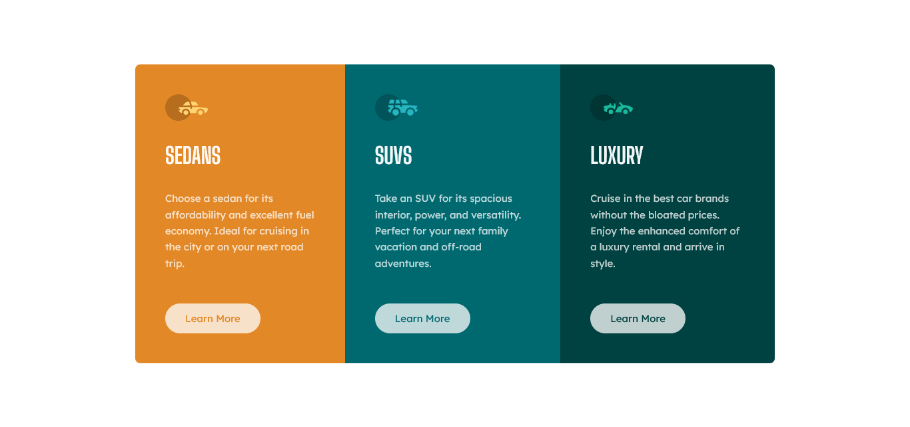

# Frontend Mentor - 3-column preview card component solution

This is a solution to the [3-column preview card component challenge on Frontend Mentor](https://www.frontendmentor.io/challenges/3column-preview-card-component-pH92eAR2-). Frontend Mentor challenges help you improve your coding skills by building realistic projects.

## Table of contents

- [Frontend Mentor - 3-column preview card component solution](#frontend-mentor---3-column-preview-card-component-solution)
  - [Table of contents](#table-of-contents)
  - [Overview](#overview)
    - [The challenge](#the-challenge)
    - [Screenshot](#screenshot)
    - [Links](#links)
  - [My process](#my-process)
    - [Built with](#built-with)
    - [What I learned](#what-i-learned)
    - [Useful resources](#useful-resources)
  - [Author](#author)

**Note: Delete this note and update the table of contents based on what sections you keep.**

## Overview

### The challenge

Users should be able to:

- View the optimal layout depending on their device's screen size
- See hover states for interactive elements

### Screenshot



### Links

- Solution URL: [Right here!](https://www.frontendmentor.io/solutions/responsive-card-component-built-with-no-boilerplate-svelte-windicss-S176ov8X5)
- Live Site URL: [Deployed on Vercel](https://3-column-preview-card-component-iota-five.vercel.app/)

## My process

### Built with

- [Svelte](https://svelte.dev/)
- [WindiCSS](https://windicss.org/)
- Flexbox
- Mobile-first workflow
- Vite

### What I learned

I learnt to use WindiCSS's safelist config option to prevent dynamic concatenations from being removed at compile step. Will come in handy going forward.

```html
<script>
  // ...
  export let color;
</script>

<!-- Windi cannot guess the possible combinations-->
<section class="... bg-{color}">
  <!-- ... -->
  <button class="... text-{color}">Learn More</button>
</section>
```

```js
// solved
export default defineConfig({
  safelist: [
    'bg-orange',
    'text-orange',
    'bg-cyan-600',
    'text-cyan-600',
    'bg-cyan-700',
    'text-cyan-700',
  ]
}

```

### Useful resources

- [WindiCSS's safelist](https://www.frontendmentor.io/profile/OGShawnLee) - Helped a lot.

## Author

- Frontend Mentor - [@Shawn Lee](https://www.frontendmentor.io/profile/OGShawnLee)
